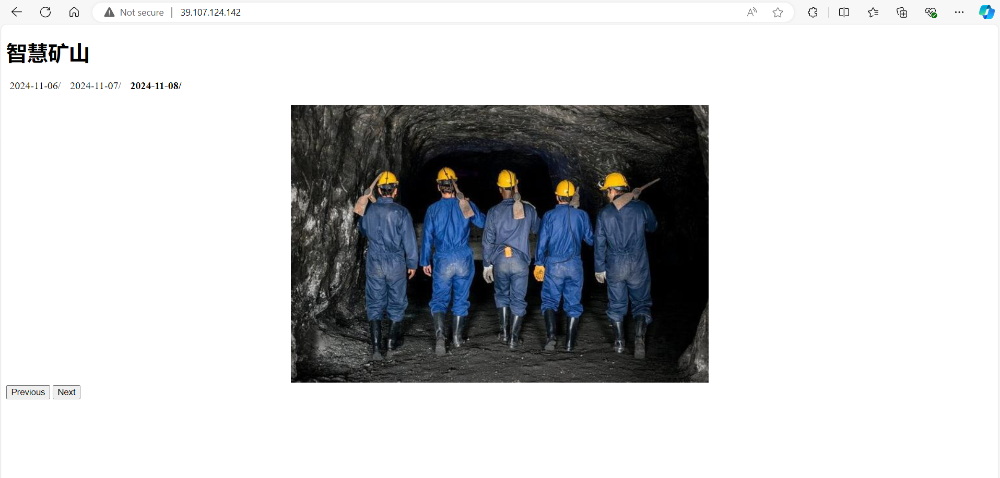

# 1. System requires
    Install python from: https://www.python.org/downloads/

# 2. Edge Server Setup
## 2.1 Environment Setup
	pip install opencv-python opencv-contrib-python Pillow numpy oss2 -i https://pypi.tuna.tsinghua.edu.cn/simple
## 2.2 Configuration
	camera-config.json
	oss-config.json
## 2.3 	Run the Camera App
	python camera_app.py

# 3. ECS Server Setup
## 3.1 Environment Setup
	sudo apt-get update
	sudo apt-get install python3-virtualenv
	virtualenv venv
	source venv/bin/activate
	pip install oss2
## 3.2 Configuration
	oss-config.json
## 3.3 Run Web App in Background
	nohup python app.py &

# 3. View Photos Using a Web Browser
	